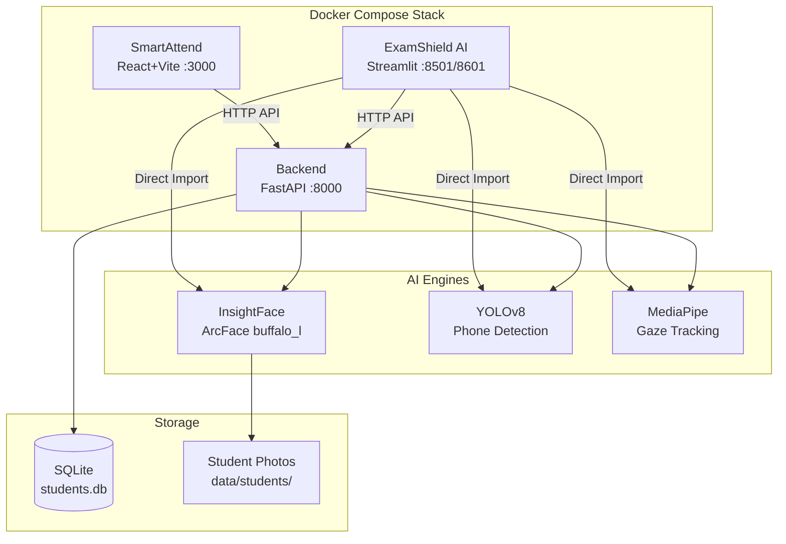

[](https://www.python.org/)
[](https://fastapi.tiangolo.com/)
[](https://react.dev/)
[](https://streamlit.io/)
[](https://www.docker.com/)


# 🎓 CampusAI Suite

> AI-powered classroom management system — automated attendance via face recognition and real-time exam proctoring.

**Team Mongolchari** · Daffodil International University · DIU AI Hackathon 2026

---

## 📋 Overview

CampusAI Suite is a two-module platform that brings computer vision into the classroom:

| Module | Purpose | Interface |
|---|---|---|
| **SmartAttend** | Automated face-recognition attendance from 3 wide-angle classroom photos | React + Vite |
| **ExamShield AI** | Real-time exam proctoring with phone detection, gaze tracking & risk scoring | Streamlit |

Both modules share a **FastAPI backend** powered by InsightFace, YOLOv8, and MediaPipe.

---

## 🎬 Demo Video

[](https://youtu.be/crDxwwjXU4w)

> 📹 **[▶ Watch Full Demo](https://youtu.be/crDxwwjXU4w)** — Complete walkthrough of SmartAttend face-recognition attendance and ExamShield AI real-time exam proctoring in action.

---

## 🏗️ Architecture



---

## ✨ Features

### SmartAttend

- Teacher captures **3 wide-angle photos** (left, center, right) of the classroom
- AI detects and recognizes every face using **InsightFace ArcFace** (buffalo_l)
- Generates attendance: **Present** / **Absent** / **Low Confidence**
- Teacher override for edge cases
- Export to **CSV** and **PDF**
- "Laptop Testing Mode" toggle for single-person demos
- Premium glassmorphic dark-theme UI

### ExamShield AI

- **Entry Verification** — camera captures student at the door, matches against student DB
- **Live Monitoring** — real-time webcam feed with:
  - Multi-face detection and auto-attribution
  - Phone / cheat sheet detection (YOLOv8)
  - Gaze deviation tracking (MediaPipe)
  - Per-student risk scoring with evidence screenshots
  - Unknown face flagging
- **Exam Roster** — expected vs. verified students
- **Integrity Report** — PDF with full incident log

---

## 🛠️ Tech Stack

| Layer | Technology |
|---|---|
| Backend | FastAPI, SQLAlchemy, SQLite |
| SmartAttend Frontend | React 18, Vite, Axios |
| ExamShield Frontend | Streamlit |
| Face Recognition | InsightFace (ArcFace buffalo_l) |
| Object Detection | YOLOv8 Nano (Ultralytics) |
| Gaze Estimation | MediaPipe FaceLandmarker |
| Reports | ReportLab (PDF) |
| Infrastructure | Docker, Docker Compose |
| Languages | Python 3.11, JavaScript (ES Modules) |

---

## 📁 Project Structure

```
Campus_AI_DIU/
├── backend/                        # FastAPI backend server
│   ├── main.py                     # Entry point — initializes all engines
│   ├── database.py                 # SQLAlchemy engine + session
│   ├── models.py                   # ORM models (Student, AttendanceSession, etc.)
│   ├── core/
│   │   ├── config.py               # Settings, thresholds, paths
│   │   ├── face_engine.py          # InsightFace wrapper
│   │   ├── yolo_engine.py          # YOLOv8 wrapper
│   │   ├── gaze_engine.py          # MediaPipe gaze estimation
│   │   └── attend_fusion.py        # 3-photo union attendance logic
│   ├── routers/
│   │   ├── enroll.py               # POST /enroll/student
│   │   ├── attend.py               # SmartAttend endpoints
│   │   └── exam.py                 # ExamShield endpoints
│   └── utils/
│       ├── report.py               # PDF generation (ReportLab)
│       └── cleanup_sentinels.py    # DB cleanup utility
├── smartattend-frontend/           # React + Vite frontend
│   ├── src/
│   │   ├── App.jsx                 # 3-step flow: Select → Capture → Results
│   │   ├── main.jsx                # React root mount
│   │   ├── index.css               # Premium glassmorphic dark theme
│   │   ├── pages/
│   │   │   ├── ClassSelector.jsx   # Section/subject selection
│   │   │   ├── CaptureScreen.jsx   # 3-angle webcam capture
│   │   │   └── ResultsScreen.jsx   # Attendance results + export
│   │   └── api/
│   │       └── index.js            # Axios API client
│   └── package.json
├── examshield-frontend/            # Streamlit dashboard
│   ├── app.py                      # Proctoring dashboard
│   ├── run_direct.ps1              # Windows launcher
│   └── run_direct.sh               # Linux/Mac launcher
├── ml/                             # ML scripts and utilities
│   ├── enroll_batch.py             # Batch student enrollment
│   ├── enroll_single.py            # Single student enrollment
│   ├── rename_student_folders.py   # Folder naming utility
│   ├── test_real_attendance.py     # Recognition test
│   ├── test_phase2_validation.py   # Competition scenario validation
│   ├── test_webcam_smartattend.py  # Standalone webcam attendance test
│   ├── verify_foundation.py        # System health check
│   ├── diagnose_insightface.py     # InsightFace diagnostic
│   └── models/
│       └── face_landmarker.task    # MediaPipe model
├── data/                           # Runtime data (not in git)
│   ├── students/                   # Student photo folders
│   ├── students.db                 # SQLite database
│   └── student_id_mapping.txt      # ID-to-name mapping
├── docker-compose.yml              # 3-service Docker stack
├── Dockerfile.backend              # Python 3.11-slim image
├── requirements.txt                # Python dependencies
├── DOCKER_GUIDE.md                 # Detailed Docker instructions
└── yolov8n.pt                      # YOLOv8 nano model (not in git)
```

---

## 📌 Prerequisites

| Requirement | When Needed |
|---|---|
| [Docker Desktop](https://www.docker.com/products/docker-desktop/) | Always (primary way to run) |
| Git | Always |
| Python 3.11+ | ExamShield local webcam mode only |
| Node.js 18+ | SmartAttend outside Docker only |

---

## 🚀 Quick Start

```bash
# Clone the repo
git clone https://github.com/Sukantanath108/DIU_AI_Hackathon.git
cd DIU_AI_Hackathon

# Start all services
docker compose up --build
```

Once running:

| Service | URL |
|---|---|
| SmartAttend | http://localhost:3000 |
| ExamShield AI | http://localhost:8501 |
| Backend API | http://localhost:8000 |
| API Docs (Swagger) | http://localhost:8000/docs |

---

## 🗂️ Setting Up the Student Database

> Student photos are **not included** in this repo for privacy reasons.

**Create your own student database:**

1. Create folders inside `data/students/` with the naming convention `SXXX_Firstname_Lastname`:
   ```
   data/students/S000_John_Doe/
   data/students/S001_Jane_Smith/
   ```
2. Place **3–5 clear face photos** of each student in their folder.
3. Run batch enrollment:
   ```bash
   python -m ml.enroll_batch
   ```
   This generates face embeddings and stores them in `data/students.db`.

**Enroll a single new student:**
```bash
python -m ml.enroll_single S026
```

---

## 📥 Downloading Required ML Models

| Model | Purpose | Action |
|---|---|---|
| **YOLOv8 Nano** | Phone / object detection | Download [`yolov8n.pt`](https://github.com/ultralytics/assets/releases/download/v8.2.0/yolov8n.pt) and place in project root. Auto-downloads on first run if online. |
| **MediaPipe FaceLandmarker** | Gaze tracking | Already included at `ml/models/face_landmarker.task` — no action needed. |

---

## 🎥 Running ExamShield with Webcam (Windows)

Docker Desktop on Windows **cannot pass the webcam** into containers. To use ExamShield's live monitoring:

1. Keep the backend running in Docker.
2. Stop the Docker ExamShield container:
   ```powershell
   docker compose stop examshield-frontend
   ```
3. Run ExamShield locally:
   ```powershell
   cd examshield-frontend
   .\run_direct.ps1
   ```
4. Open http://localhost:8601

---

## ✅ Testing Each Module

**Backend health check:**
```bash
curl http://localhost:8000
# Returns: {"status": "ok", "message": "Welcome to the CampusAI Suite MVP Backend API."}
```

**SmartAttend:**
1. Open http://localhost:3000
2. Select a section and subject
3. Capture 3 classroom photos (left, center, right)
4. Submit and review attendance results

**Standalone webcam test (no browser):**
```bash
python -m ml.test_webcam_smartattend
```

**ExamShield AI:**
1. Open http://localhost:8601 (local) or http://localhost:8501 (Docker)
2. Test Entry Verification with the camera
3. Start Live Monitoring
4. Hold up a phone to test detection

**System health check:**
```bash
python -m ml.verify_foundation
```

---

## 📡 API Endpoints

| Method | Endpoint | Description |
|---|---|---|
| `POST` | `/enroll/student` | Enroll a new student |
| `POST` | `/attend/session` | Create attendance session |
| `POST` | `/attend/photos` | Submit classroom photos for recognition |
| `POST` | `/attend/override` | Teacher override |
| `GET` | `/attend/export/{session_id}` | Export attendance (CSV/PDF) |
| `POST` | `/exam/session` | Create exam session |
| `POST` | `/exam/verify_entry` | Verify student at exam entry |
| `POST` | `/exam/event` | Log exam incident |
| `GET` | `/exam/report/{session_id}` | Generate integrity report (PDF) |

Full interactive documentation: http://localhost:8000/docs

---

## 👥 Team

**Team Mongolchari** — Daffodil International University

Built for the **DIU AI Hackathon 2026**.

---

<p align="center"><i>Made with ❤️ for smarter classrooms</i></p>
